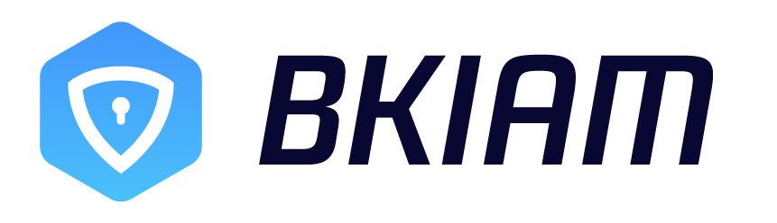

---

  

## Overview

BK-IAM is a centralized permission management service provided by The Tencent BlueKing, which supports access to permission control of SaaS and enterprise third-party systems, as well as fine-grained permission management.

- [Architecture(In Chinese)](./docs/overview/architecture.md)
- [Code directory(In Chinese)](./docs/overview/project_codes.md)

## Features

BK-IAM is a universal permission control product developed based on ABAC(a powerful permission model) and combined with various permission control business scenarios. 

- Powerful permission model engine: Based on the powerful ABAC permission model, it can support as rich business permission scenarios as possible.
- Fine-grained permission control: Support instance-level permission control granularity
- Flexible permission acquisition: users can obtain it through various ways: custom application, application to join user groups, third-party system no-permission application, administrator authorization, etc.
- Permission hierarchy management: Support super administrator, system administrator, hierarchy administrator three levels of management mode.
- Organizational Structure Permission Management: Support managing permissions through organizational structure, including individual and organizational permissions management.

## Getting started

- [Local development environment setup](./docs/quick_start/develop.md)
- [Deployment and maintain](https://bk.tencent.com/docs/document/6.0/160/8394) / [log files](https://bk.tencent.com/docs/document/6.0/160/8398?r=1)
- [Official Doc: Access guidelines
](https://bk.tencent.com/docs/document/6.0/160/8391)

## Roadmap

- [release log](release.md)

## SDK

- [TencentBlueKing/iam-python-sdk](https://github.com/TencentBlueKing/iam-python-sdk)
- [TencentBlueKing/iam-go-sdk](https://github.com/TencentBlueKing/iam-go-sdk)

## Support

- [bk forum](https://bk.tencent.com/s-mart/community)
- [bk DevOps online video tutorial(In Chinese)](https://cloud.tencent.com/developer/edu/major-100008)
- Contact us, technical exchange QQ group:

## BlueKing Community

- [BK-CI](https://github.com/Tencent/bk-ci)：a continuous integration and continuous delivery system that can easily present your R & D process to you.
- [BK-BCS](https://github.com/Tencent/bk-bcs)：a basic container service platform which provides orchestration and management for micro-service business.
- [BK-BCS-SaaS](https://github.com/Tencent/bk-bcs-saas)：a SaaS provides users with highly scalable, flexible and easy-to-use container products and services.
- [BK-PaaS](https://github.com/Tencent/bk-PaaS)：an development platform that allows developers to create, develop, deploy and manage SaaS applications easily and quickly.
- [BK-SOPS](https://github.com/Tencent/bk-sops)：an lightweight scheduling SaaS  for task flow scheduling and execution through a visual graphical interface. 
- [BK-CMDB](https://github.com/Tencent/bk-cmdb)：an enterprise-level configuration management platform for assets and applications.

## Contributing

If you have good ideas or suggestions, please let us know by Issues or Pull Requests and contribute to the Blue Whale Open Source Community.

## License

Based on the MIT protocol. Please refer to [LICENSE](LICENSE.txt)
